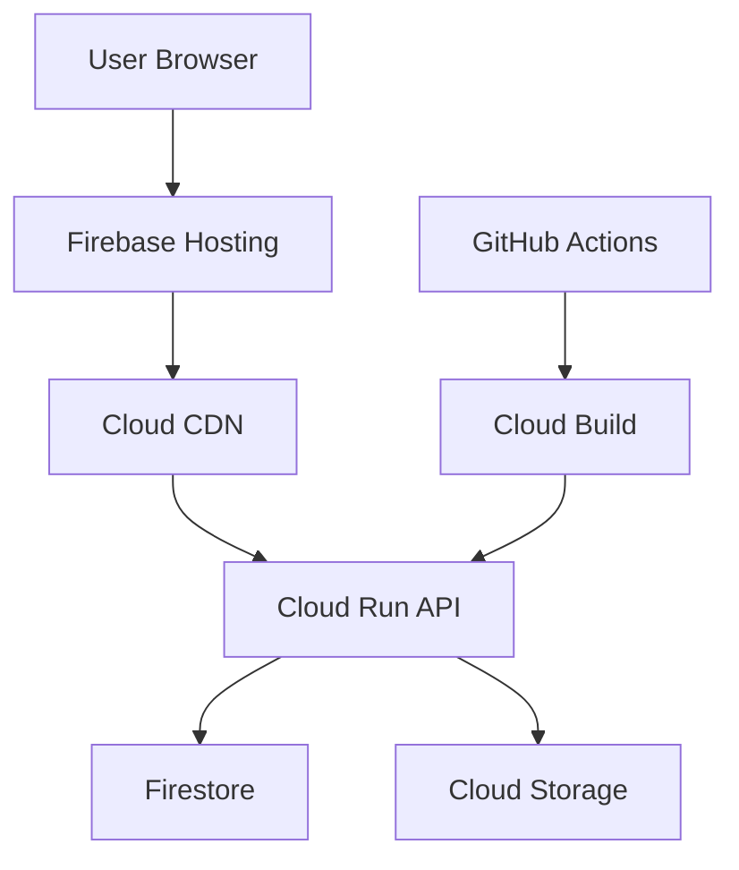

# DirectorX GCP Deployment Guide

🌐 **Google Cloud Platform上でのDirectorX本番デプロイメント完全ガイド**

## 📊 アーキテクチャ概要



### 🏗️ **使用サービス**

| サービス | 用途 | 無料枠 | 推定コスト/月 |
|---------|------|--------|-------------|
| **Firebase Hosting** | フロントエンド配信 | 10GB | 無料～$1 |
| **Cloud Run** | バックエンドAPI | 180万リクエスト | $2～5 |
| **Firestore** | データベース | 1GB, 50K操作 | 無料～$3 |
| **Cloud Storage** | ファイル保存 | 5GB | $1～3 |
| **Cloud CDN** | グローバル配信 | 自動統合 | $0.5～2 |
| **Cloud Build** | CI/CD | 120分/日 | 無料～$2 |
| **合計** | | | **$3.50～16** |

## 🚀 クイックスタート

### 1. 前提条件

```bash
# 必須ツールのインストール確認
node --version    # v18以上
npm --version     # v8以上
docker --version  # 20以上

# GCP CLI & Firebase CLI
gcloud --version  
firebase --version

# インストールが必要な場合
curl https://sdk.cloud.google.com | bash
npm install -g firebase-tools
```

### 2. ワンクリックデプロイ

```bash
# リポジトリクローン
git clone <your-repo-url>
cd directorx

# 自動デプロイスクリプト実行
./scripts/deploy-gcp.sh production

# または環境指定
./scripts/deploy-gcp.sh dev      # 開発環境
./scripts/deploy-gcp.sh staging  # ステージング環境
```

### 3. 手動デプロイ（詳細制御）

#### ステップ1: GCPプロジェクト作成

```bash
# プロジェクト作成
gcloud projects create directorx-production --name="DirectorX Production"
gcloud config set project directorx-production

# 課金アカウント設定 (必要に応じて)
gcloud beta billing projects link directorx-production --billing-account=XXXXXX-XXXXXX-XXXXXX

# 必要なAPI有効化
gcloud services enable run.googleapis.com
gcloud services enable cloudbuild.googleapis.com
gcloud services enable storage-api.googleapis.com
gcloud services enable firestore.googleapis.com
```

#### ステップ2: Firebase初期化

```bash
# Firebase ログイン & プロジェクト選択
firebase login
firebase use --add directorx-production

# Firebase サービス初期化
firebase init hosting
firebase init firestore
firebase init storage
```

#### ステップ3: バックエンドデプロイ

```bash
# Cloud Run デプロイ
cd api
gcloud builds submit --tag gcr.io/directorx-production/directorx-api
gcloud run deploy directorx-api \
  --image gcr.io/directorx-production/directorx-api \
  --platform managed \
  --region us-central1 \
  --allow-unauthenticated \
  --memory 1Gi \
  --set-env-vars NODE_ENV=production
```

#### ステップ4: フロントエンドデプロイ

```bash
# フロントエンド ビルド & デプロイ
cd ../web
npm install
npm run build
cd ..
firebase deploy --only hosting
```

## 🔧 詳細設定

### 環境変数設定

#### Cloud Run 環境変数

```bash
gcloud run services update directorx-api \
  --set-env-vars \
  GOOGLE_CLOUD_PROJECT=directorx-production,\
  FIRESTORE_DATABASE=directorx-prod,\
  STORAGE_BUCKET_ASSETS=directorx-production-assets,\
  STORAGE_BUCKET_OUTPUTS=directorx-production-outputs,\
  NODE_ENV=production,\
  CORS_ORIGIN=https://directorx-production.web.app
```

#### フロントエンド環境変数

```bash
# web/.env.production
VITE_API_BASE_URL=https://directorx-api-xxxxx-uc.a.run.app
VITE_GCP_PROJECT_ID=directorx-production
VITE_FIREBASE_API_KEY=your-api-key
VITE_FIREBASE_AUTH_DOMAIN=directorx-production.firebaseapp.com
VITE_FIREBASE_PROJECT_ID=directorx-production
VITE_FIREBASE_STORAGE_BUCKET=directorx-production.appspot.com
VITE_FIREBASE_MESSAGING_SENDER_ID=123456789
VITE_FIREBASE_APP_ID=your-app-id
```

### カスタムドメイン設定

```bash
# Firebase Hostingでカスタムドメイン追加
firebase hosting:channel:deploy production --expires 7d
firebase hosting:sites:create your-custom-domain

# Cloud Run でカスタムドメイン追加
gcloud run domain-mappings create \
  --service directorx-api \
  --domain api.your-domain.com \
  --region us-central1
```

### SSL証明書 (自動管理)

Firebase HostingとCloud Runは自動的にSSL証明書を管理します。

## 🔐 セキュリティ設定

### IAM & サービスアカウント

```bash
# API用サービスアカウント作成
gcloud iam service-accounts create directorx-api \
  --description="DirectorX API Service Account" \
  --display-name="DirectorX API"

# 必要な権限付与
gcloud projects add-iam-policy-binding directorx-production \
  --member="serviceAccount:directorx-api@directorx-production.iam.gserviceaccount.com" \
  --role="roles/datastore.user"

gcloud projects add-iam-policy-binding directorx-production \
  --member="serviceAccount:directorx-api@directorx-production.iam.gserviceaccount.com" \
  --role="roles/storage.admin"
```

### Firestore Security Rules

```javascript
// firestore.rules の重要ポイント
rules_version = '2';
service cloud.firestore {
  match /databases/{database}/documents {
    // 認証済みユーザーのみアクセス
    match /assets/{assetId} {
      allow read, write: if request.auth != null 
        && resource.data.userId == request.auth.uid;
    }
    
    match /recipes/{recipeId} {
      allow read, write: if request.auth != null 
        && resource.data.userId == request.auth.uid;
    }
  }
}
```

## 🚀 CI/CD パイプライン

### GitHub Actions 設定

1. **リポジトリシークレット設定**:
   - `GCP_PROJECT_ID`: directorx-production
   - `GCP_SERVICE_ACCOUNT_KEY`: サービスアカウントJSONキー
   - `FIREBASE_TOKEN`: Firebase CLI トークン

2. **自動デプロイ**:
   ```bash
   # Firebase トークン取得
   firebase login:ci
   
   # GitHub リポジトリにシークレット追加
   # Settings > Secrets and variables > Actions
   ```

### デプロイトリガー

- **main ブランチ**: 本番環境自動デプロイ
- **develop ブランチ**: ステージング環境自動デプロイ
- **Pull Request**: プレビュー環境作成

## 📊 監視・ログ

### Cloud Monitoring 設定

```bash
# アラートポリシー作成
gcloud alpha monitoring policies create --policy-from-file=monitoring-policy.yaml

# ダッシュボード作成
gcloud monitoring dashboards create --config-from-file=dashboard.json
```

### ログ確認

```bash
# Cloud Run ログ
gcloud logs read "resource.type=cloud_run_revision" --limit=50

# Firebase Functions ログ
firebase functions:log

# リアルタイムログ監視
gcloud logs tail "resource.type=cloud_run_revision"
```

### パフォーマンス監視

- **Cloud Trace**: リクエスト追跡
- **Cloud Profiler**: パフォーマンス分析  
- **Error Reporting**: エラー集約
- **Cloud Monitoring**: メトリクス監視

## 💰 コスト最適化

### 無料枠の活用

```bash
# 現在の使用量確認
gcloud billing budgets list
gcloud logging read "resource.type=billing_account" --limit=10

# 予算アラート設定
gcloud billing budgets create \
  --billing-account=BILLING_ACCOUNT_ID \
  --display-name="DirectorX Budget" \
  --budget-amount=50USD
```

### リソース最適化

1. **Cloud Run**:
   - 最小インスタンス数: 0 (コールドスタート許容)
   - 最大インスタンス数: 10 (トラフィック制御)
   - CPU割り当て: リクエスト時のみ

2. **Cloud Storage**:
   - ライフサイクルルール設定
   - 古いファイル自動削除
   - 適切なストレージクラス選択

3. **Firestore**:
   - インデックス最適化
   - 不要なフィールド除去
   - クエリ効率化

## 🔧 トラブルシューティング

### よくある問題

#### 1. デプロイ失敗

```bash
# Cloud Build ログ確認
gcloud builds log BUILD_ID

# Cloud Run サービス確認
gcloud run services describe directorx-api --region us-central1

# 権限確認
gcloud projects get-iam-policy directorx-production
```

#### 2. Firebase Hosting エラー

```bash
# デプロイ状況確認
firebase hosting:channel:list

# ビルドログ確認
npm run build

# キャッシュクリア
firebase hosting:channel:delete preview
```

#### 3. API接続エラー

```bash
# CORS設定確認
gcloud run services describe directorx-api --format="value(spec.template.spec.containers[].env[].name,spec.template.spec.containers[].env[].value)"

# ヘルスチェック
curl -f https://your-api-url.a.run.app/health
```

### ログ分析

```bash
# エラー率確認
gcloud logging read "resource.type=cloud_run_revision AND severity>=ERROR" --limit=100

# レスポンス時間分析
gcloud logging read "resource.type=cloud_run_revision AND httpRequest.latency>2s" --limit=50
```

## 🎯 本番運用チェックリスト

### セキュリティ ✅
- [ ] Firebase Auth 設定完了
- [ ] Firestore Security Rules 適用
- [ ] Cloud Storage IAM 設定
- [ ] SSL証明書 自動更新
- [ ] CORS設定 適切に制限
- [ ] API Rate Limiting 設定

### パフォーマンス ✅
- [ ] CDN キャッシュ設定
- [ ] 静的アセット最適化
- [ ] バンドルサイズ最適化
- [ ] データベース インデックス
- [ ] Cloud Run 設定最適化

### 監視・アラート ✅
- [ ] エラー率監視
- [ ] レスポンス時間監視
- [ ] リソース使用量監視
- [ ] 予算アラート設定
- [ ] アップタイム監視

### バックアップ・DR ✅
- [ ] Firestore 自動バックアップ
- [ ] Cloud Storage バージョニング
- [ ] 設定ファイル バックアップ
- [ ] 障害復旧手順書
- [ ] データ復旧テスト

## 🌟 高度な機能

### マルチリージョン展開

```bash
# 複数リージョンにデプロイ
gcloud run deploy directorx-api-asia \
  --image gcr.io/directorx-production/directorx-api \
  --region asia-northeast1

# Load Balancer設定
gcloud compute backend-services create directorx-backend-service
```

### A/Bテスト

```bash
# Firebase A/B Testing
firebase experiments:create --help
```

### 機械学習統合

```bash
# Vertex AI 設定
gcloud ai-platform models create directorx-ml-model
```

## 📞 サポート・問い合わせ

- **GCP サポート**: https://cloud.google.com/support
- **Firebase サポート**: https://firebase.google.com/support
- **DirectorX 開発チーム**: your-team@email.com

---

**🎉 DirectorX on GCP - スケーラブルで高性能な動画制作プラットフォーム！**

コスト効率とパフォーマンスを両立した世界最高峰のクラウドインフラで、DirectorXを世界中のユーザーに提供しましょう。